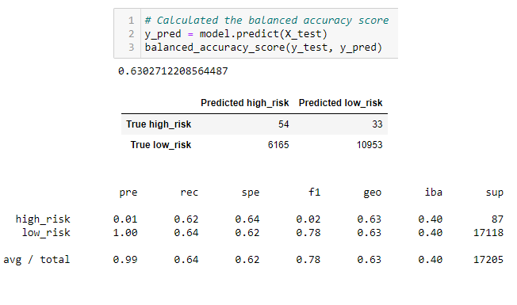
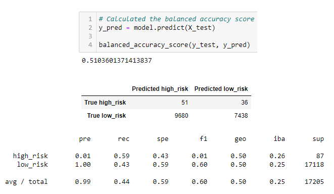
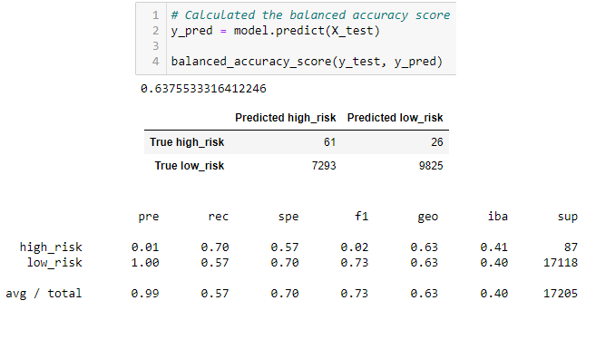
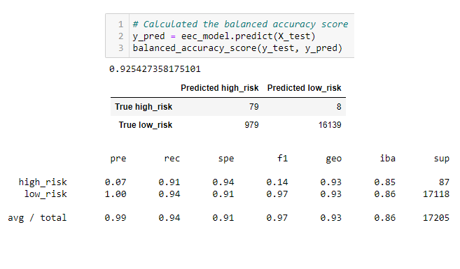

# Credit_Risk_Analysis
## Objective
The objective of this project was to evaluate the performance of multiple machine learning data models and their ability to predict credit risk based upon a real-world dataset of credit card credit. The evaluations of these data models will be compared to see if any are reasonable tools to help predict credit risk. This challenge utilized Python via Jupyter Notebook, as well as utilizing scikit-learn and imbalanced-learn libraries.
  
#### Predictive Models
---
The following machine learning models were utilized in this challenge:
- **RandomOversampler** and **SMOTE** oversampling algorithms
- **ClusterCentroids** undersampling algorithm
- **SMOTEENN** combination sampling algorithm
- **BalancedRandomForestClassifier** and **EasyEnsembleAdaBoostClassifier** ensemble classifier algorithms

## Results
**RandomOverSampler Model** 
<kbd><kbd>
- The balanced accuracy score of the RandomOverSampler model was 63.67%
- The precision of the high_risk credit scores was 1% and the high-risk recall was 62%, leading to a F1 score of 2%.
- The precision of the low_risk credit scores was 100% and the low-risk recall was 65%, leading to a F1 score of 79%.  

**SMOTE Model** 
<kbd><kbd>
- The balanced accuracy score of the SMOTE model was 63.03%
- The precision of the high_risk credit scores was 1% and the high-risk recall was 62%, leading to a F1 score of 2%.
- The precision of the low_risk credit scores was 100% and the low-risk recall was 64%, leading to a F1 score of 78%.  
 
**ClusterCentroids Undersampling Model** 
<kbd><kbd>
- The balanced accuracy score of the ClusterCentroids model was 51.04%
- The precision of the high_risk credit scores was 1% and the high-risk recall was 59%, leading to a F1 score of 1%.
- The precision of the low_risk credit scores was 100% and the low-risk recall was 43%, leading to a F1 score of 60%.  

**SMOTEENN Combination Sampling Model** 
<kbd><kbd>
- The balanced accuracy score of the SMOTEENN model was 63.76%
- The precision of the high_risk credit scores was 1% and the high-risk recall was 70%, leading to a F1 score of 2%.
- The precision of the low_risk credit scores was 100% and the low-risk recall was 57%, leading to a F1 score of 73%.  

**BalancedRandomForestClassifier Model** 
<kbd><kbd>
- The balanced accuracy score of the BalancedRandomForestClassifier model was 78.78%
- The precision of the high_risk credit scores was 4% and the high-risk recall was 67%, leading to a F1 score of 7%.
- The precision of the low_risk credit scores was 100% and the low-risk recall was 91%, leading to a F1 score of 95%.  
 
**EasyEnsembleAdaBoostClassifier Model** 
<kbd><kbd>
- The balanced accuracy score of the EasyEnsembleAdaBoostClassifier model was 92.54%
- The precision of the high_risk credit scores was 7% and the high-risk recall was 91%, leading to a F1 score of 14%.
- The precision of the low_risk credit scores was 100% and the low-risk recall was 94%, leading to a F1 score of 97%.  
 

## Conclusions

 
Summary: Summarize the results of the machine learning models, and include a recommendation on the model to use, if any. If you do not recommend any of the models, justify your reasoning.
 
 We see that 38.24% of the Amazon Vine reviews were rated 5 stars, whereas the unpaid Amazon reviews had 54.47% rated with 5 stars. We cannot conclude that the paid advertisements had a bias towards 5-star ratings based on this information. However, because the size of the paid pool of reviews is significantly smaller than the pool of all unpaid reviews, it would be a challenge to ascertain if a paid review presented negative bias.

Future analysis should investigate the statistical distribution of all ratings, from 1- to 5-stars, between the paid and unpaid analyses to see if a pattern appears that indicates bias towards more positive ratings.

