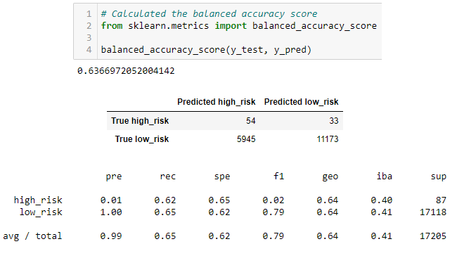

# Credit_Risk_Analysis
## Objective
The objective of this project was to evaluate the performance of multiple machine learning data models and their ability to predict credit risk based upon a real-world dataset of credit card credit. The evaluations of these data models will be compared to see if any are reasonable tools to help predict credit risk. This challenge utilized Python via Jupyter Notebook, as well as utilizing scikit-learn and imbalanced-learn libraries.
  
#### Predictive Models
---
The following machine learning models were utilized in this challenge:
- **RandomOversampler** and **SMOTE** oversampling algorithms
- **ClusterCentroids** undersampling algorithm
- **SMOTEENN** combination sampling algorithm
- **BalancedRandomForestClassifier** and **EasyEnsembleAdaBoostClassifier** ensemble classifier algorithms

## Results
**RandomOverSampler Model** 
<kbd><kbd>
- The balanced accuracy score of the xxx model was xx.xx%
- The precision of the high_risk credit scores was xx.xx% and the high-risk recall was xx.xx%, leading to a F1 score of xx.xx%.
- The precision of the low_risk credit scores was xx.xx% and the low-risk recall was xx.xx%, leading to a F1 score of xx.xx%.  

**SMOTE Model** 
<kbd><kbd>
- The balanced accuracy score of the xxx model was xx.xx%
- The precision of the high_risk credit scores was xx.xx% and the high-risk recall was xx.xx%, leading to a F1 score of xx.xx%.
- The precision of the low_risk credit scores was xx.xx% and the low-risk recall was xx.xx%, leading to a F1 score of xx.xx%.  
 
**ClusterCentroids Undersampling Model** 
<kbd><kbd>
- The balanced accuracy score of the xxx model was xx.xx%
- The precision of the high_risk credit scores was xx.xx% and the high-risk recall was xx.xx%, leading to a F1 score of xx.xx%.
- The precision of the low_risk credit scores was xx.xx% and the low-risk recall was xx.xx%, leading to a F1 score of xx.xx%.  

**SMOTEENN Combination Sampling Model** 
<kbd><kbd>
- The balanced accuracy score of the xxx model was xx.xx%
- The precision of the high_risk credit scores was xx.xx% and the high-risk recall was xx.xx%, leading to a F1 score of xx.xx%.
- The precision of the low_risk credit scores was xx.xx% and the low-risk recall was xx.xx%, leading to a F1 score of xx.xx%.  

**BalancedRandomForestClassifier Model** 
<kbd><kbd>
- The balanced accuracy score of the xxx model was xx.xx%
- The precision of the high_risk credit scores was xx.xx% and the high-risk recall was xx.xx%, leading to a F1 score of xx.xx%.
- The precision of the low_risk credit scores was xx.xx% and the low-risk recall was xx.xx%, leading to a F1 score of xx.xx%.  
 
**EasyEnsembleAdaBoostClassifier Model** 
<kbd><kbd>
- The balanced accuracy score of the xxx model was xx.xx%
- The precision of the high_risk credit scores was xx.xx% and the high-risk recall was xx.xx%, leading to a F1 score of xx.xx%.
- The precision of the low_risk credit scores was xx.xx% and the low-risk recall was xx.xx%, leading to a F1 score of xx.xx%.  
 

## Conclusions

<kbd><kbd>
